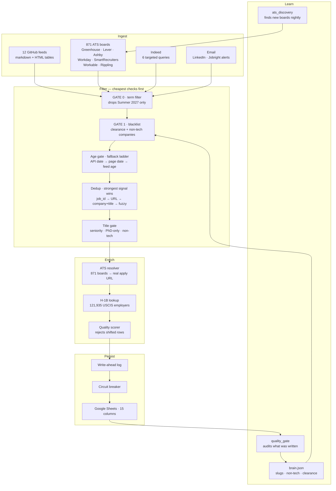

# Job Aggregation Pipeline

[](tests/)
[](aggregator/preflight.py)
[](https://python.org)
[]()

A self-maintaining data pipeline that aggregates early-career software engineering
roles from 12 curated feeds, 871 applicant-tracking-system boards, and Indeed —
then deduplicates, validates, enriches with official H-1B sponsorship data, and
writes the survivors to a tracked spreadsheet three times a day.

It is built around one assumption: **every component will eventually fail
silently, including the components built to detect failure.** Most of the design
below follows from taking that seriously.

---

## Contents

- [Architecture](#architecture)
- [Data sources](#data-sources)
- [Engineering decisions](#engineering-decisions)
- [Self-maintenance](#self-maintenance)
- [Failure modes](#failure-modes)
- [Running it](#running-it)
- [Project layout](#project-layout)
- [Testing philosophy](#testing-philosophy)

---

## Architecture



Every run begins with a **preflight check** that verifies the wiring above is
actually connected — see [Self-maintenance](#self-maintenance).

---

## Data sources

| Source | Boards / feeds | Job IDs | Posting dates |
|---|---:|---:|---|
| Greenhouse | 419 | 97% | `updated_at` |
| Ashby | 225 | 97% | `publishedAt` |
| Workday tenants | 227 | high | `postedOn` (bucketed) |
| Lever | 111 | high | `createdAt` (epoch ms) |
| SmartRecruiters | 67 | high | `releasedDate` |
| Workable | 26 | high | `published_on` |
| Rippling | 12 | — | none — dropped by the age gate |
| GitHub feeds | 12 | 32–71% | age column, `0d`–`52m`–`Aug 21` |
| Indeed | 6 queries | — | `date_posted`, 100% coverage |

ATS board counts grow on their own. `ats_discovery` inspects every URL the
pipeline has processed, identifies boards it has not seen, probes their API, and
appends the working ones to `brain.json`. The hardcoded starting set was 263
companies; discovery has taken it to 871 without manual curation.

---

## Engineering decisions

### Dedup is tiered, and the strongest signal wins

Four independent identity signals, evaluated in order of confidence. A verdict
from a stronger tier ends the check — a weaker signal is never allowed to
override it.

| Tier | Signal | Confidence |
|---|---|---|
| 1 | Normalised `job_id` against a 1,243-entry registry | certain |
| 2 | Canonical URL — **only when the URL identifies one posting** | certain |
| 3 | Company + title, with legal-suffix normalisation | high |
| 4 | TF-IDF cosine ≥ 0.90, guarded by a discriminator | low |

The parenthetical in tier 2 is load-bearing. URL canonicalisation strips query
strings, which means every Google-search fallback URL collapses to the same
string — 306 rows in the live sheet shared one key. Deduplicating on that would
have silently dropped the next fallback job of *any* company as a duplicate of an
unrelated one. `is_identifying_url()` excludes search pages, listing pages and
bare domains from tier 2 entirely; those fall through to tier 3.

Tier 4 needed a similar guard. TF-IDF scores whole titles, so the single token
carrying the meaning gets averaged away: `Software Engineer II` scored **1.00**
against `Software Engineer I`, and `DeFi Algorithmic Trader` scored **0.99**
against `Algorithmic Trader`. Both were being discarded. The guard is word-set
based rather than positional — two titles differ when one carries a meaningful
word the other lacks, or when level markers disagree. Reordering is not a
difference, so `Single-Family SW Dev Intern` still merges with
`SW Dev Intern - Single-Family`.

### Check-and-claim is atomic

The post-fetch duplicate check originally skipped the in-progress set on the
assumption that the caller had already claimed the URL. It had not. `existing_urls`
is a snapshot taken at startup, so when six worker threads processed the same
posting concurrently, none of them appeared in it and **all six wrote**. Seven
identical rows from one source reached the sheet in a single run.

Check and claim now happen inside the same lock. Verified under load: seven
concurrent threads on one URL produce exactly one write.

### Filters fail open

Every filter is written so that an unexpected input is *kept*, not dropped.
A false positive costs one glance; a false negative costs an application you
never knew existed.

The Summer-2027 term filter is the clearest example:

1. Full-time roles never enter the filter at all
2. Any Fall / Spring / Winter / co-op signal means keep, immediately
3. Only an unambiguous phrase (`Summer 2027`, `2027 Summer`) triggers a drop —
   never a bare year, never a bare "Summer"
4. Ambiguous input is kept; silence is not evidence
5. An exception inside the filter keeps the job

Verified against live data: 637 full-time rows, zero dropped.

### Sponsorship comes from primary sources

The Sponsorship column is populated from the **USCIS H-1B Employer Data Hub** —
121,935 employers, fiscal years 2022–2026, approvals summed across every filing
entity and worksite.

USCIS rather than DOL because DOL's disclosure files record who *filed* an LCA,
while USCIS records who was *approved* — a stronger signal, in a file two orders
of magnitude smaller. Third-party aggregators were rejected: they are mirrors of
these same two datasets with a UI on top, and add a scraping dependency without
adding accuracy.

Name matching is deliberately conservative. Word-boundary comparison rather than
character prefixes, because `Advanced Space` matched `ADVANCED TECHNOLOGY
LABORATORIES` under prefix matching — a false "Yes" is worse than no answer. The
lookup never returns `No`; absence from the file means small or new, not
unwilling.

### Provenance ranking

Where two sources disagree about the same job, the more authoritative one wins:
an ATS API response beats a scraped page, which beats a feed's markdown cell,
which beats anything derived from a URL slug. This is why direct-ATS rows carry
clean company names while feed-derived rows historically did not.

---

## Self-maintenance

### Preflight — verifying the verifiers

Twelve checks run at the start of every aggregator run, inside the one process
that provably executes. They verify *connections*, not logic:

| Check | Catches |
|---|---|
| Control characters | `\b` saved as `\x08`, `\1` as `\x01` — invisible in an editor, fatal at runtime |
| Scheduler dispatch | A declared job type with no branch in the loop, so those jobs never run |
| Learning loop | Writer, store and reader disagreeing on a path or a key name |
| Sources processed | A feed that is fetched every run and then silently discarded |
| Cross-module calls | A method called on another module that does not exist there |
| Age parser | Round-trips every date format the sources actually emit |
| ATS posting dates | Hardcoded ages, and loop-variable mismatches that `NameError` per job |
| Config parses | `config.py` is rewritten at runtime by the auto-blacklist |
| Shell functions | A `.sh` calling a function it never defines |
| Orphaned modules | Code unreachable from any entry point — graph-based, so mutually-importing dead clusters cannot hide |
| Shadowed constants | A local copy of a config constant silently overriding it |
| Duplicate definitions | The same function defined twice, second silently winning |

The last three exist because each caught a real, live bug. The orphan check is
graph-based specifically because a naive per-file version missed an eleven-file
dead package — those files imported each other, so every one of them looked
referenced.

Preflight never blocks a run. It reports loudly and continues.

### Learning loop

```
quality_gate  →  brain.json  →  apply_learned
   audits          stores          applies upstream
```

`quality_gate` runs after every write, auditing what actually landed in the
sheet: URL–company mismatches, non-tech titles, clearance companies, duplicate
job IDs, shifted rows. Corrections are stored in `brain.json` and applied by
`apply_learned` on the *next* run — so each mistake moves from being corrected
after the fact to being prevented before the write.

### Resilience

- **Write-ahead log** — sheet writes are journaled and replayed after a crash
- **Circuit breaker** — opens after 5 consecutive Sheets failures, half-opens
  after 60s, closes after 2 successes; prevents hammering a rate-limited API
- **Atomic JSON** — 16 state files write to a temp file and `os.replace()`;
  the previous truncate-then-write pattern corrupted the correction log
- **HTTP cache** — 6-hour TTL, persisted between runs so the 15:00 and 21:00
  runs reuse pages fetched at 08:00
- **Snapshots + caps** — every destructive sheet operation takes a CSV snapshot
  first and aborts if it would delete more than 5% of rows

---

## Failure modes

Documented deliberately, because the interesting question about a pipeline is
not what it does when everything works.

| Failure | Behaviour |
|---|---|
| A source goes down | Other sources continue; `health_heartbeat` alerts when any of 24 sources drops below its rolling baseline |
| Google Sheets rate-limits | Circuit breaker opens, writes are skipped and retried next run rather than lost |
| Process crashes mid-write | WAL replays the incomplete transaction on next start |
| A job page has no date anywhere | Logged as `NO DATE` and kept — the fallthrough list contained Microsoft, Oracle and LinkedIn, so dropping was the wrong default |
| A filter raises an exception | The job is kept, never dropped |
| A company name is 90 characters | Rejected as a shifted row — caps are set from the observed distribution (company p99 = 36, title p99 = 71), not round numbers |
| Two threads race on one job | Atomic check-and-claim; one write |
| The registry grows unbounded | Pruned above 5,000 entries, saves throttled to once a minute |

---

## Running it

### Requirements

- Python 3.10+
- Google Cloud service account with Sheets API access
- Microsoft Graph credentials (outreach only)

### Setup

```bash
git clone https://github.com/prasad0411/job-market-intelligence.git
cd job-market-intelligence
python3 -m venv venv && source venv/bin/activate
pip install -r requirements.txt
```

Place the Google service account JSON at `.local/credentials.json`.
Everything under `.local/` is gitignored — credentials, caches and learned state
never leave the machine.

### Commands

```bash
python3 -m aggregator.run_aggregator     # full pipeline
python3 -m aggregator.preflight          # wiring check, standalone
python3 -m pytest tests/                 # 250 tests
python3 scripts/status.py                # current state
```

### Schedule

Thirteen jobs under `launchd`. The aggregator runs at 08:00, 15:00 and 21:00;
`quality_gate` and `health_heartbeat` fire after each successful write.

```bash
launchctl kickstart -k gui/$(id -u)/com.prasad.jobtracker.scheduler
```

### Refreshing sponsorship data

USCIS stopped publishing direct fiscal-year CSVs after FY2023. Current data comes
from the Tableau export on the H-1B Employer Data Hub — download as CSV, drop it
in `.local/h1b/`, and delete `.local/h1b_sponsors.json` to force a rebuild. The
loader handles the export's UTF-16 encoding, tab separation, and six-column
approval split. Quarterly is enough; sponsorship is a stable company property.

---

## Project layout

```
aggregator/
  run_aggregator.py     orchestration, filter gates, dedup
  direct_sources.py     7 ATS platform scrapers
  extractors.py         feed parsing, HTTP cache
  processors.py         title/location/validation helpers
  preflight.py          12 wiring checks
  h1b_data.py           USCIS sponsorship lookup
  term_filter.py        Summer-2027 filter, fail-open
  job_age.py            ATS date extraction
  atomic_json.py        crash-safe state writes
  url_validator.py      integrity checks before write
  sheets_manager.py     Sheets API, circuit breaker
  wal.py                write-ahead log
  config.py             feed URLs, curated name/slug maps

scripts/
  scheduler.py          launchd daemon, 13 jobs
  quality_gate.py       post-write audit → brain.json
  ats_discovery.py      finds new ATS boards nightly
  health_heartbeat.py   24-source monitoring

analytics/              ETL, anomaly detection, title similarity
outreach/               email discovery, verification, sending
tests/                  250 tests, 17 of them wiring-specific
```

---

## Testing philosophy

250 tests, but the count is not the point. The suite previously passed at 265
tests while a date filter was accepting months-old postings — because those tests
asserted that code *existed* rather than that it *worked*.

Three rules now:

**A test that cannot fail is not a test.** Assertions like
`assert isinstance(result, str)` and `assert dec == "REJECT" or dec is None` were
removed or rewritten to assert one expected outcome.

**Test behaviour, not source text.** Regression checks that grepped for a string
in a source file passed happily while the code containing that string never ran.

**Every bug gets a test named after what it broke.** `tests/test_wiring.py`
carries seventeen of these — the age parser against every real format, blank-cell
column shifts, hardcoded ATS ages, the learning-loop round trip, full-time roles
surviving the internship gate, fuzzy dedup preserving specialisations, and
preflight itself being demonstrably capable of detecting an injected bug.

---

## Scale

| | |
|---|---:|
| Python | 84 files · 38,438 lines |
| Sources | 12 feeds · 871 ATS boards · Indeed |
| Jobs evaluated per run | ~5,000 |
| Sponsorship dataset | 121,935 employers, FY2022–2026 |
| Job ID registry | 1,243 |
| Scheduled jobs | 13 |
| Preflight checks | 12 |
| Tests | 250 |

---

## Author

**Prasad Kanade** — MS Computer Science, Northeastern University

[GitHub](https://github.com/prasad0411) ·
[LinkedIn](https://linkedin.com/in/prasad-kanade-/) ·
[Portfolio](https://prasad0411.github.io/Prasad-Portfolio/) ·
kanade.pra@northeastern.edu
